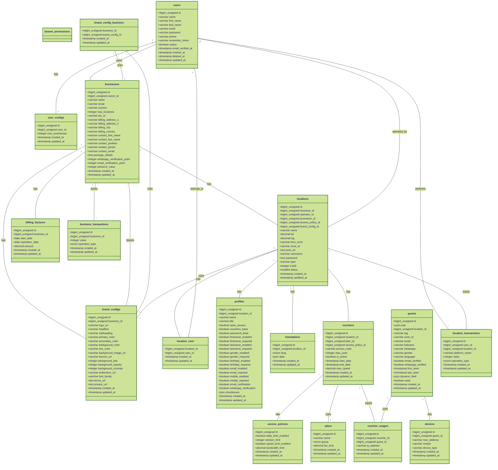

# NextWi Database Class Diagram

## Relationships

- **User to UserConfig**: One-to-one relationship. A user can have one configuration.
- **User to Business**: One-to-many relationship. A user can own multiple businesses.
- **Business to Location**: One-to-many relationship. A business can have multiple locations.
- **Location to BrandConfig**: Many-to-one relationship. Multiple locations can use the same brand configuration.
- **Location to User**: Many-to-many relationship through LocationUser table. Users can have access to multiple locations.
- **Location to User (Operator)**: Many-to-one relationship. A location has one operator (which is a user).